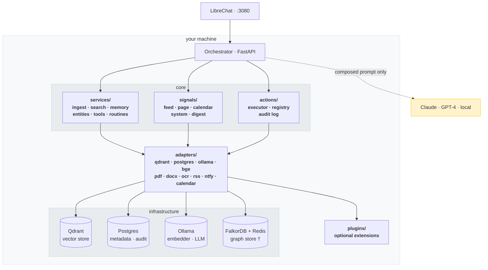

**[Quickstart](#getting-started) · [Architecture](#architecture) · [Extending Lumogis](#contributing) · [Community Plugins](COMMUNITY-PLUGINS.md) · [Security](SECURITY.md)**

# lumogis

**The AI comes to your data. Not the other way around.**

---


*Ask about a decision from your meeting notes. Ask what you settled on in a previous conversation. Lumogis finds it — locally, privately, without being told where to look.*

---

You know the moment. You are about to paste something private into ChatGPT — a draft contract, a medical question, a business plan you have been building for months — and you feel it. A half-second of hesitation. A small voice that says: *should I be doing this?*

And then you do it anyway. Because the alternative is worse.

Lumogis fixes the thing that causes the hesitation. Your files, documents, and conversations are indexed and stored entirely on your own machine. When you ask a question, Lumogis assembles the relevant context from your local index and sends a composed prompt — your question plus the pieces of your thinking that bear on it — to whichever model is best suited. Claude for deep reasoning. GPT-4 for breadth. A local model for anything you want to keep completely offline. Your archive never travels. What travels is a question.

This is not a privacy policy. It is not a setting. It is physically impossible for your files to reach a Lumogis server, because there is no Lumogis server. The source is public under the AGPL — anyone can verify it.

When using a local model, nothing leaves your machine at all. When using a cloud model, only the composed prompt — your question plus the retrieved excerpts — travels to the model provider. Your raw files, full document corpus, embeddings, and conversation history never move.

*Privacy is not a setting here. It is the architecture.*

---

## What it does (summary)

**lumogis processes, stores, and serves all data locally.** Every document you ingest, every entity extracted, every signal scored — it happens on your machine, in your containers, under your control.

- Ingests and indexes your documents (PDF, DOCX, text, images via OCR)
- Runs semantic search with two-stage retrieval (vector + reranker)
- Maintains session memory across conversations
- Extracts and stores entities (people, organisations, projects, concepts)
- Monitors signal sources (RSS feeds, web pages, calendars)
- Scores signals by relevance and sends a daily digest via ntfy
- Executes actions with full audit logging and Ask/Do safety enforcement
- Routes queries to any LLM — local via Ollama, or cloud via API key
- Loads plugins automatically from `plugins/` — drop one in and it activates

---

## How it works

**Private semantic search.** Documents are chunked, embedded, and stored in a local Qdrant vector database using Nomic Embed via Ollama. Search runs entirely on your machine. No outbound calls, no external embedding APIs.

**Two-stage retrieval.** Vector search narrows the candidate set. When enabled, a local BGE reranker re-scores candidates by relevance before context is assembled. Enable with `RERANKER_BACKEND=bge` in `.env`.

**Session memory.** Conversation summaries are embedded and stored locally. Context from past sessions is retrieved and injected into future ones. A question you asked three months ago, and the conclusion you reached, can inform the answer you get today.

**Entity extraction.** People, organisations, projects, and concepts mentioned across conversations and documents are extracted and stored in a local knowledge base.

**Signal monitoring and digest.** RSS feeds, web pages, and calendar events are polled on a schedule. Each signal is scored for importance and relevance. A configurable daily digest sends the top signals via ntfy. Plugins extend what happens with signals beyond the built-in digest.

**Action execution.** Actions are defined, registered, and executed with a full audit trail. The Ask/Do safety model controls what runs automatically and what requires your approval.

**Model routing.** Route queries to Claude, GPT-4, a local Llama or Qwen model, or any OpenAI-compatible endpoint. Adding a provider is a config entry in `config/models.yaml` — zero code changes.

**File ingestion.** Plain text, Markdown, PDF, DOCX, and scanned images (via OCR) are supported out of the box. Drop a file in your indexed folder and it is searchable in seconds.

---

## Security model: Ask and Do

Every action in lumogis belongs to one of two modes:

| Mode | Behaviour |
|---|---|
| **Ask** | Proposed to you for approval before execution. Used for anything that writes, deletes, or sends. |
| **Do** | Executed immediately without confirmation. Used for reads and reversible, low-risk operations. |

**Examples:**

| Action | Mode | Reason |
|---|---|---|
| Read file contents | Do | Non-destructive, no side effects |
| Search documents | Do | Read-only, no side effects |
| Refresh RSS feed cache | Do | Scoped, reversible |
| Draft an email reply | Ask | Proposes output — nothing sent until you confirm |
| Create a calendar event | Ask | Writes to external system — requires confirmation |
| Send a message | Ask | External consequence — always requires explicit approval |
| Move a file | Ask | Filesystem write — proposed before execution |
| Delete a file | Ask | Irreversible — always Ask, cannot be elevated to Do |
| Tag a photo (Immich) | Do | Trusted scope, explicitly configured, reversible |

Actions that accumulate a clean approval record are eligible for routine elevation — they move from Ask to Do automatically after a configurable threshold. You can always demote an action back to Ask. This is not a capability system. Trust is earned, recorded, and revocable.

---

## Architecture

Five concepts. Everything in the codebase maps to one of them.



_† FalkorDB and Redis are only started when the graph plugin is present._

| Concept | Lives in | Purpose |
|---|---|---|
| **Services** | `services/` | Business logic — ingest, search, memory, entity extraction, routines |
| **Adapters** | `adapters/` | One file per external system. Swap a backend by writing one adapter. |
| **Plugins** | `plugins/<name>/` | Optional, self-contained extensions. Core works without any. |
| **Signals** | `signals/` | Source monitors that detect and score incoming signals |
| **Actions** | `actions/` | Executable operations with audit logging and Ask/Do enforcement |

---

## Why not X?

The self-hosted AI space is crowded. Here is how Lumogis differs from the projects you have probably heard of.

| | Jan.ai | AnythingLLM | OpenClaw | Lumogis |
|---|---|---|---|---|
| **Privacy model** | Policy — cloud MCP connectors send data out | Policy | No safety model by design | Architecture — files never leave. Local model: nothing leaves. Cloud model: composed prompt only. |
| **Personal data** | Gmail, Drive, Notion via cloud MCP | Documents only | Files, messaging, email | Files, documents, sessions, entities — all local |
| **Session memory** | None | None | Partial | Full — past sessions retrieved and injected automatically |
| **Agent safety** | No approval loop | No approval loop | None | Ask/Do — every action proposed before execution, full audit log |
| **Automation** | Reactive only | Reactive only | Background agents | Proactive signals + scheduled digests + reactive chat |
| **Architecture** | Chat app with connectors bolted on | RAG tool | Monolithic | Ports and adapters — swap any backend with one `.env` change |

**Jan.ai** is a polished local chat app with 5.3M downloads. If you want a better private ChatGPT with connectors to your cloud accounts, Jan is excellent. Lumogis is a different product — it indexes your data locally and builds memory over time. Jan's MCP connectors send data to cloud services. Lumogis's architecture makes that structurally impossible.

**AnythingLLM** is the best document RAG tool in the self-hosted space. It answers questions about your files well. It has no session memory, no proactive signals, and no human-in-the-loop safety model. If chat-with-documents is all you need, AnythingLLM is the right choice. Lumogis adds the layers that turn a RAG tool into a persistent personal AI.

**OpenClaw** showed how much appetite there is for self-hosted personal AI agents — and public disclosures showed how badly things can go wrong without a tight safety and supply-chain story. In February 2026 a critical remote-code-execution issue was published for affected deployments ([CVE-2026-25253](https://nvd.nist.gov/vuln/detail/CVE-2026-25253), CVSS 8.8, with a [GitHub advisory](https://github.com/openclaw/openclaw/security/advisories/GHSA-g8p2-7wf7-98mq)); independent reporting also described large numbers of internet-exposed installs and malicious third-party “skill” content in marketplaces. Lumogis is designed around local-first data, human-in-the-loop approvals (Ask/Do), and auditable actions — choices aimed at reducing that class of risk. The collapsible section below links primary sources if you want to read the original write-ups.

<details>
<summary>Sources for OpenClaw security claims</summary>

- CVE-2026-25253 (CVSS 8.8): [NVD — National Vulnerability Database](https://nvd.nist.gov/vuln/detail/CVE-2026-25253)
- GitHub Security Advisory GHSA-g8p2-7wf7-98mq: [openclaw/openclaw](https://github.com/openclaw/openclaw/security/advisories/GHSA-g8p2-7wf7-98mq)
- 40,000+ exposed instances: [Infosecurity Magazine](https://www.infosecurity-magazine.com/news/researchers-40000-exposed-openclaw/) · [runZero exposure analysis](https://www.runzero.com/blog/openclaw/)
- ClawHavoc campaign — 341 malicious skills: [Snyk ToxicSkills research](https://snyk.io/blog/toxicskills-malicious-ai-agent-skills-clawhub/)
- Full technical breakdown: [The Hacker News](https://thehackernews.com/2026/02/openclaw-bug-enables-one-click-remote.html)

</details>

---

## Hardware requirements

| Tier | GPU VRAM | RAM | Recommended for |
|---|---|---|---|
| **minimal** | No GPU / < 4 GB | 8 GB | Testing and evaluation. CPU inference only. Slow but functional. |
| **standard** | 4–8 GB | 16 GB | Daily use on mid-range hardware (GTX 1070, RTX 3060, etc.) |
| **recommended** | 8–16 GB | 32 GB | Comfortable everyday use (RTX 3080, RTX 4070, etc.) |
| **power** | 16 GB+ | 64 GB | Large context, parallel inference (RTX 4090, A100, etc.) |

Minimum to run: 8 GB RAM, 20 GB free disk. No API keys required — all models run locally via Ollama. Add `ANTHROPIC_API_KEY` or `OPENAI_API_KEY` to `.env` to enable cloud model routing.

---

## Prerequisites

| Requirement | Linux | macOS | Windows |
|---|---|---|---|
| **Git** | usually pre-installed | usually pre-installed | [git-scm.com](https://git-scm.com) |
| **Docker Desktop** | [docs.docker.com](https://docs.docker.com/desktop/install/linux/) | [docs.docker.com](https://docs.docker.com/desktop/install/mac/) | [docs.docker.com](https://docs.docker.com/desktop/setup/install/windows-install/) |

That is the complete list. No `make`, no WSL2, no Python required.

---

## Getting started

**Linux / macOS:**
```bash
git clone https://github.com/lumogis/lumogis.git ~/lumogis
cd ~/lumogis && cp .env.example .env && docker compose up -d
```

**Windows (PowerShell):**
```powershell
git clone https://github.com/lumogis/lumogis.git $HOME\lumogis
cd "$HOME\lumogis"; Copy-Item .env.example .env; docker compose up -d
```

Open **[http://localhost:8000/dashboard](http://localhost:8000/dashboard)** — the setup wizard guides you through adding an API key or pulling a local model.

**LibreChat:** `config/librechat.yaml` is runtime-generated (gitignored). Commit only `config/librechat.coldstart.yaml` — the orchestrator entrypoint seeds `librechat.yaml` on first boot, then replaces it from `models.yaml` and Ollama.

- **Chat:** [http://localhost:3080](http://localhost:3080)
- **Dashboard:** [http://localhost:8000/dashboard](http://localhost:8000/dashboard)

The stack pins a **current** [Ollama](https://ollama.com/) release in `docker-compose.yml` (bumped over time so new library models like **Gemma 4** pull successfully — Docker’s `:latest` tag can lag). The embedding model (~300 MB) and a **small default chat model** (**Llama 3.2 3B**, ~2 GB) pull automatically on first start. The dashboard lists the full Ollama catalog; pull larger models only when you want them. Secrets are generated automatically. Expect a few minutes until services are healthy on first boot. Tune pulls with `OLLAMA_EXTRA_MODELS` in `.env` (see `.env.example`).

<details>
<summary>Optional: folder browser, GPU, advanced</summary>

**Folder browser** — browse your host filesystem from the dashboard. Copy the override for your OS before starting:

```bash
# Linux
cp docker-compose.override.yml.linux docker-compose.override.yml

# macOS
cp docker-compose.override.yml.macos docker-compose.override.yml
```

```powershell
# Windows
Copy-Item docker-compose.override.yml.windows docker-compose.override.yml
```

Skip this if you only need the default indexed folder (`./lumogis-data` inside the project).

**GPU acceleration** — add to `.env`:

```bash
COMPOSE_FILE=docker-compose.yml:docker-compose.gpu.yml
```

Then restart: `docker compose up -d`. Requires NVIDIA Container Toolkit on Linux. See [docs/gpu-setup.md](docs/gpu-setup.md).

**API explorer** — [http://localhost:8000/docs](http://localhost:8000/docs) (Swagger UI).

</details>

---

### Contributing

Clone the repo, run `docker compose up -d`, and use `make compose-test` / `make compose-lint` for CI inside the container. See `Makefile` for all available targets.

---

## Configuration

All backend selection is driven by `.env`. The defaults work out of the box.

```bash
# Backend selection — swap by changing one value
VECTOR_STORE_BACKEND=qdrant       # qdrant (default), chroma, milvus
METADATA_STORE_BACKEND=postgres   # postgres (default), sqlite
EMBEDDER_BACKEND=ollama           # ollama (default), sentence-transformers
RERANKER_BACKEND=none             # none (default), bge (downloads ~400 MB from HuggingFace)
EXTRACTOR_OCR_ENABLED=true        # true (default), false

# Connection details — defaults match docker-compose service names
QDRANT_URL=http://qdrant:6333
POSTGRES_HOST=postgres
POSTGRES_PORT=5432
POSTGRES_USER=lumogis
POSTGRES_PASSWORD=lumogis-dev
POSTGRES_DB=lumogis
OLLAMA_URL=http://ollama:11434
EMBEDDING_MODEL=nomic-embed-text
RERANKER_MODEL=BAAI/bge-reranker-base

# Graph plugin — only used if plugins/graph/ is present
FALKORDB_URL=redis://falkordb:6379

# Safety model
DEFAULT_ACTION_MODE=ask           # ask (default) or do
ROUTINE_ELEVATION_THRESHOLD=10    # clean approvals before auto-elevation
```

---

## What is required vs optional

`docker compose up -d` starts the minimal required stack. Everything else is opt-in.

| Component | Status | Purpose |
|---|---|---|
| Orchestrator (FastAPI) | Required | Core runtime — ingest, search, memory, actions |
| Qdrant | Required | Vector store for documents, sessions, entities |
| Postgres | Required | Metadata, file index, audit log, entity relations |
| Ollama | Required | Local embeddings (Nomic Embed) and local LLM inference |
| BGE Reranker | Optional | Two-stage retrieval — re-scores candidates by relevance. Enable with `RERANKER_BACKEND=bge` in `.env`. |
| LibreChat | Required | Chat interface at localhost:3080 |
| FalkorDB + Redis | Optional | Graph store — only started when the graph plugin is present |
| LiteLLM | Optional | Unified model proxy — enables multi-provider routing in one endpoint |
| Activepieces | Optional | Automation UI — nightly ingest, session triggers, scheduled digests |
| Playwright | Optional | JS rendering for web page signal sources |

To start optional components, use the corresponding compose override:
```bash
# Graph layer
docker compose -f docker-compose.yml -f docker-compose.falkordb.yml up -d

# LiteLLM proxy
docker compose -f docker-compose.yml -f docker-compose.litellm.yml up -d

# Automation UI (Activepieces)
docker compose -f docker-compose.yml -f docker-compose.activepieces.yml up -d

# GPU acceleration
docker compose -f docker-compose.yml -f docker-compose.gpu.yml up -d

# JS-rendered web sources
docker compose -f docker-compose.yml -f docker-compose.playwright.yml up -d
```

---

## Extending the stack

Add optional infrastructure (push notifications, automation UI, LiteLLM proxy, JS rendering) or extend the orchestrator with new adapters, signal sources, action handlers, and plugins.

See [docs/extending-the-stack.md](docs/extending-the-stack.md) for the full guide.

---

## Project structure

```
orchestrator/
  main.py              # FastAPI app, startup health checks, plugin loading
  loop.py              # Tool-calling loop (LLM ↔ tools)
  config.py            # Reads .env, returns cached adapter singletons
  hooks.py             # Event dispatch: fire() sync, fire_background() threaded
  events.py            # Event name constants (Event class)
  auth.py              # Authentication
  permissions.py       # Permission enforcement

  services/            # Business logic (five concepts: services)
    ingest.py          # Document ingest pipeline
    search.py          # Semantic search + reranking
    memory.py          # Session memory
    entities.py        # Entity extraction and resolution
    tools.py           # Tool definitions and dispatcher
    signal_processor.py
    routines.py
    feedback.py

  adapters/            # One file per external system (five concepts: adapters)
    anthropic_llm.py   # Claude (Anthropic SDK)
    openai_llm.py      # OpenAI-compatible (Ollama, ChatGPT, Perplexity, …)
    qdrant_store.py
    postgres_store.py
    ollama_embedder.py
    bge_reranker.py
    text_extractor.py  # Auto-discovered by file extension
    pdf_extractor.py
    docx_extractor.py
    ocr_extractor.py
    rss_source.py
    ntfy_notifier.py

  signals/             # Source monitors (five concepts: signals)
    feed_monitor.py    # RSS and Atom feeds
    page_monitor.py    # Web page change detection
    calendar_monitor.py
    system_monitor.py
    digest.py          # Periodic top-signals digest via notifier

  actions/             # Executable operations (five concepts: actions)
    registry.py        # Action registration
    executor.py        # Ask/Do enforcement + execution
    audit.py           # Immutable audit log
    reversibility.py   # Reversibility metadata
    handlers/          # One file per action domain

  plugins/             # Optional extensions — drop a package here and it loads automatically
    # Start from the template in docs/examples/example_plugin/

  models/              # Pydantic request/response models
  routes/              # FastAPI routers (chat, data, signals, actions, admin)
  ports/               # Protocol interfaces (internal — rarely touched)
  tests/               # Unit tests (no Docker needed)

config/
  models.yaml                 # Model registry — adapters, capabilities, endpoints
  librechat.coldstart.yaml    # Tracked LibreChat bootstrap template (seed for librechat.yaml)
  librechat.yaml              # Generated at runtime — gitignored; do not commit

postgres/
  init.sql             # Schema: file_index, entities, entity_relations, review_queue

docker/
  qdrant/Dockerfile    # Qdrant + curl (official image has no HTTP client for healthchecks)

scripts/
  init-env.sh          # Re-generate secrets manually (optional — entrypoint does this automatically)

docs/
  decisions/           # Architecture Decision Records (ADRs)
  examples/            # Example plugin template

tests/
  integration/         # Full-stack integration tests (requires Docker stack)
```

---

## FAQ

**Does Lumogis require cloud models?**
No. The default setup runs entirely locally via Ollama. Cloud models (Claude, GPT-4, etc.) are optional — add an API key to `.env` to enable them. Without an API key, everything runs on your hardware.

**What actually leaves my machine?**
It depends on which model you use.

**Local model only (Ollama):** Nothing leaves your machine. Ever. The embedding, retrieval, and answer generation all happen locally. This is the strongest privacy guarantee — architecturally impossible for any content to reach an external server. Response quality is lower than cloud models but fully capable for retrieval-grounded queries like recalling decisions, summarising notes, and finding context.

**Cloud model (Claude, GPT-4, etc.):** The retrieval still happens locally. What leaves is a composed prompt — your question plus the specific excerpts Lumogis retrieved as relevant. Your raw files, full document corpus, embeddings, and conversation history never leave. Only the assembled context for that query travels. This is meaningfully different from pasting a document into ChatGPT, but it is not zero-disclosure. For genuinely sensitive material — contracts, medical records, legal documents — use a local model.

Cloud model usage is always opt-in. No API key means no data leaves. The default setup with no API keys configured runs entirely locally.

**Where is my data stored?**
Everything stays on your machine in Docker volumes: documents and embeddings in Qdrant, metadata and entities in Postgres, raw files in your indexed folder. There is no Lumogis server.

**What is the difference between Ask and Do?**
Ask means Lumogis proposes an action and waits for your approval before executing. Do means it executes immediately within a declared, low-risk scope. Everything starts in Ask mode. Do must be explicitly enabled per connector. See the security model section above.

**Is this production-ready?**
It is a solid developer preview. Ingest, search, memory, entity extraction, signals, and actions are built and tested. It is not yet a polished consumer product. Run it, extend it, break it, contribute back.

---

## Contributing

See [CONTRIBUTING.md](CONTRIBUTING.md) for the full guide.

The short version: find the right layer, follow the existing pattern.

- **New file type extractor:** one new file in `adapters/`, auto-discovered
- **New signal source:** implement `SignalSource` from `ports/signal_source.py`
- **New action handler:** one new file in `actions/handlers/`
- **New vector store:** implement `VectorStore` from `ports/vector_store.py`
- **New plugin:** one directory in `plugins/`, any hooks and routes you need

All PRs must pass `make lint` and `make test`. Include tests for new functionality.

**The one rule:** services never import concrete adapters. Always go through `config.get_*()`.

---

## Community plugins

See [COMMUNITY-PLUGINS.md](COMMUNITY-PLUGINS.md) for community-contributed adapters and plugins.

---

## Security

To report a vulnerability, see [SECURITY.md](SECURITY.md). Do not open a public issue.

The initial security audit (SQL injection, path traversal, MCP boundary, Ask/Do enforcement) is documented in [`docs/SECURITY-AUDIT-001.md`](docs/SECURITY-AUDIT-001.md).

---

## Code of conduct

This project follows the [Contributor Covenant v2.1](CODE_OF_CONDUCT.md).

---

## License

[Lumogis is licensed under AGPL-3.0](LICENSE).

---

*Private, local, yours. The AI comes to your data. Not the other way around.*
