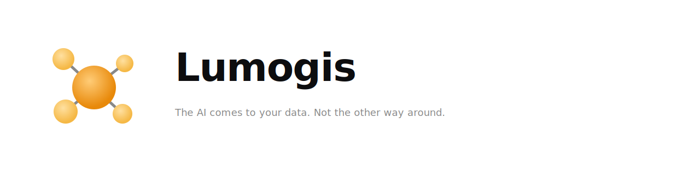
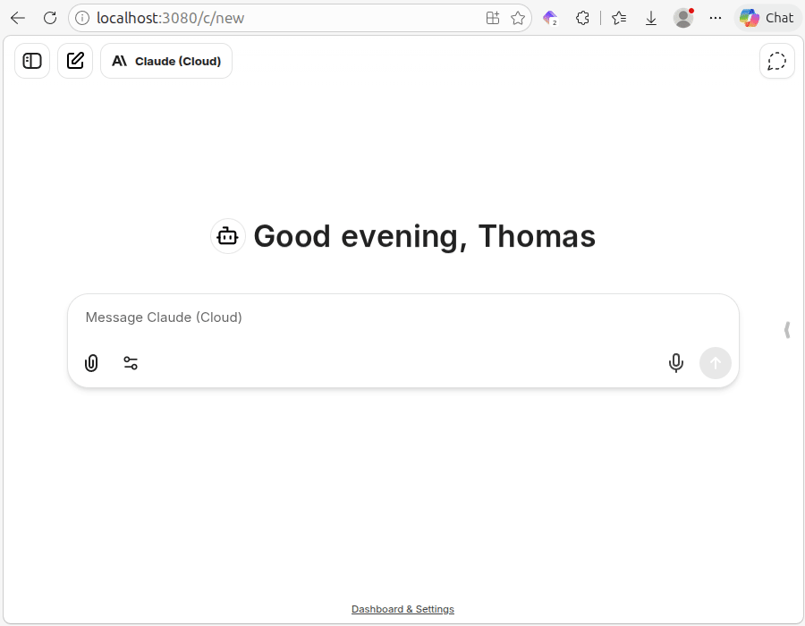

**[Quickstart](#getting-started)** · **[Architecture](#architecture)** · **[Reference manual](docs/LUMOGIS_REFERENCE_MANUAL.md)** · **[Operator runbook](docs/connect-and-verify.md)** · **[Extending Lumogis](docs/extending-the-stack.md)** · **[Community Plugins](COMMUNITY-PLUGINS.md)** · **[Security](SECURITY.md)**

# lumogis

**The AI comes to your data. Not the other way around.**

Lumogis is a **self-hosted, local-first, privacy-first** household and personal AI platform that you run yourself with Docker Compose under **AGPL-3.0-only**. Your primary UI is **[Lumogis Web](#lumogis-web)** (same origin behind **[Caddy](docker/caddy/Caddyfile)**). **Core** is the **[FastAPI](orchestrator/main.py)** orchestrator. **[LibreChat](config/librechat.coldstart.yaml)** stays available behind an optional Compose profile (`librechat`) for OpenAI-compatible chat—not the main product surface.

---



*Ask about a decision captured in notes or an earlier conversation. Retrieval and storage run locally—you are not handing the archive to a SaaS indexer.*

---

## Why Lumogis

You want to ask an LLM questions **grounded in your documents and sessions**, without exporting your corpus to someone else’s cloud.

- **Indexing and retrieval stay on your machine.** Default Compose brings up **Qdrant** for vectors, **Postgres** for metadata (fresh volumes bootstrap from `postgres/init.sql`), and **Ollama** for local embeddings/models—see **`docker-compose.yml`**.

- **When you choose a cloud model**, the provider receives a **composed prompt**: your query plus excerpts Core selected from local retrieval—not your full corpus or embeddings. With **purely local inference**, the **LLM call stays on your host** (your usual outbound traffic, logging, and supply-chain realities still apply).

The source code is **[AGPL-3.0-only](LICENSE)**. There is no Lumogis-operated SaaS substrate in this story—verification is cloning and reading code.

---

## What it does (summary)

**All processing defaults to containers on your machine.** Ingest → chunk → embed → search → sessions → signals → audited actions—all under your Compose project.

| Area | Capability |
|---|---|
| Documents | PDF, DOCX, text, images (OCR when enabled)—see ingestion in [`orchestrator/services/ingest.py`](orchestrator/services/ingest.py) |
| Search | Dense vectors + optional hybrid / reranking—[`services/search.py`](orchestrator/services/search.py), [`ARCHITECTURE.md`](ARCHITECTURE.md) |
| Memory | Sessions and summaries embedded locally |
| Signals | RSS, pages, calendars, digest—[`signals/`](orchestrator/signals/) |
| Actions | **[Ask / Do](#security-model-ask-and-do)** with audit logging—[`actions/`](orchestrator/actions/) |
| Models | Local via Ollama; cloud via adapters and `config/models.yaml` |
| Plugins | **[Optional packages](docs/examples/example_plugin/)** under [`orchestrator/plugins/`](orchestrator/plugins/)—loaded at startup |

---

## Security model: Ask and Do

Every action lands in **Ask** or **Do**:

| Mode | Behaviour |
|---|---|
| **Ask** | Proposed for approval before anything writes, deletes, or sends externally. |
| **Do** | Executes immediately within a scoped, reversible, low-risk contract. |

Details and examples: **[`docs/LUMOGIS_REFERENCE_MANUAL.md`](docs/LUMOGIS_REFERENCE_MANUAL.md)** (operator narrative) and audit discussion in **[`docs/SECURITY-AUDIT-001.md`](docs/SECURITY-AUDIT-001.md)**.

---

## Architecture

**Five concepts**—every module maps to one: **services**, **adapters**, **plugins**, **signals**, **actions**. Full layering (routes → services → ports ← adapters; plugins via hooks): **[`ARCHITECTURE.md`](ARCHITECTURE.md)**.

<svg viewBox="0 0 900 680" xmlns="http://www.w3.org/2000/svg" font-family="-apple-system, BlinkMacSystemFont, 'Inter', 'Segoe UI', sans-serif">
  <defs>
    <marker id="arrowhead" markerWidth="7" markerHeight="7" refX="6" refY="3.5" orient="auto">
      <polygon points="0 0, 7 3.5, 0 7" fill="#999"/>
    </marker>
    <marker id="arrowhead-light" markerWidth="7" markerHeight="7" refX="6" refY="3.5" orient="auto">
      <polygon points="0 0, 7 3.5, 0 7" fill="#bbb"/>
    </marker>
  </defs>

  <!-- Background -->
  <rect width="900" height="680" fill="#f8f8f6"/>

  <!-- Title -->
  <text x="32" y="24" font-size="11" font-weight="600" letter-spacing="0.08em" fill="#888" text-anchor="start">LUMOGIS · SYSTEM ARCHITECTURE</text>

  <!-- ── EXTERNAL ROW ── -->

  <!-- Browser -->
  <rect x="370" y="36" width="100" height="36" rx="5" fill="#e8e8f0" stroke="#b0b0c8"/>
  <text x="420" y="58" text-anchor="middle" font-size="12" font-weight="600" fill="#2a2a2a">Browser</text>

  <!-- LibreChat -->
  <rect x="20" y="36" width="140" height="48" rx="5" fill="#e8e8f0" stroke="#b0b0c8"/>
  <text x="90" y="56" text-anchor="middle" font-size="12" font-weight="600" fill="#2a2a2a">LibreChat</text>
  <text x="90" y="71" text-anchor="middle" font-size="10" fill="#666">optional profile</text>

  <!-- ── ROUTING ROW ── -->

  <!-- Caddy -->
  <rect x="310" y="116" width="140" height="48" rx="5" fill="#dde8f4" stroke="#9ab4d4"/>
  <text x="380" y="136" text-anchor="middle" font-size="12" font-weight="600" fill="#2a2a2a">Caddy</text>
  <text x="380" y="151" text-anchor="middle" font-size="10" fill="#666">:80 / :443 · same-origin</text>

  <!-- Lumogis Web SPA -->
  <rect x="510" y="116" width="140" height="48" rx="5" fill="#dde8f4" stroke="#9ab4d4"/>
  <text x="580" y="136" text-anchor="middle" font-size="12" font-weight="600" fill="#2a2a2a">Lumogis Web</text>
  <text x="580" y="151" text-anchor="middle" font-size="10" fill="#666">SPA · nginx</text>

  <!-- ── YOUR MACHINE BOX ── -->
  <rect x="30" y="200" width="670" height="450" rx="8" fill="#f5f3fb" stroke="#c8c0e0" stroke-width="1.5" stroke-dasharray="6,3"/>
  <text x="50" y="221" font-size="10" font-weight="600" letter-spacing="0.06em" fill="#888" text-transform="uppercase">YOUR MACHINE</text>

  <!-- ── CORE ── -->
  <rect x="270" y="230" width="170" height="52" rx="6" fill="#d6d0ea" stroke="#9080c4" stroke-width="2"/>
  <text x="355" y="253" text-anchor="middle" font-size="12" font-weight="600" fill="#2a2a2a">Core · FastAPI</text>
  <text x="355" y="269" text-anchor="middle" font-size="10" fill="#666">orchestrator · :8000</text>

  <!-- ── DOMAIN CORE LAYER ── -->
  <rect x="50" y="310" width="460" height="100" rx="6" fill="#eeecf8" stroke="#c0b8d8" stroke-dasharray="4,2"/>
  <text x="68" y="328" font-size="10" font-weight="600" letter-spacing="0.06em" fill="#888">DOMAIN CORE</text>

  <!-- Actions -->
  <rect x="68" y="335" width="110" height="58" rx="5" fill="#ebe8f5" stroke="#b4a8d8"/>
  <text x="123" y="357" text-anchor="middle" font-size="12" font-weight="600" fill="#2a2a2a">actions/</text>
  <text x="123" y="373" text-anchor="middle" font-size="10" fill="#666">Ask/Do · audit</text>
  <text x="123" y="385" text-anchor="middle" font-size="10" fill="#666">registry · executor</text>

  <!-- Signals -->
  <rect x="198" y="335" width="110" height="58" rx="5" fill="#ebe8f5" stroke="#b4a8d8"/>
  <text x="253" y="357" text-anchor="middle" font-size="12" font-weight="600" fill="#2a2a2a">signals/</text>
  <text x="253" y="373" text-anchor="middle" font-size="10" fill="#666">feed · page</text>
  <text x="253" y="385" text-anchor="middle" font-size="10" fill="#666">calendar · system</text>

  <!-- Services -->
  <rect x="328" y="335" width="160" height="58" rx="5" fill="#ebe8f5" stroke="#b4a8d8"/>
  <text x="408" y="357" text-anchor="middle" font-size="12" font-weight="600" fill="#2a2a2a">services/</text>
  <text x="408" y="373" text-anchor="middle" font-size="10" fill="#666">ingest · search · memory</text>
  <text x="408" y="385" text-anchor="middle" font-size="10" fill="#666">entities · tools · MCP</text>

  <!-- ── PLUGINS ── -->
  <rect x="540" y="310" width="130" height="100" rx="5" fill="#ebe8f5" stroke="#b4a8d8"/>
  <text x="605" y="341" text-anchor="middle" font-size="12" font-weight="600" fill="#2a2a2a">plugins/</text>
  <text x="605" y="357" text-anchor="middle" font-size="10" fill="#666">optional · in-process</text>
  <text x="605" y="373" text-anchor="middle" font-size="10" fill="#666">hooks + events</text>
  <text x="605" y="389" text-anchor="middle" font-size="10" fill="#666">config bridges</text>

  <!-- ── PORTS + ADAPTERS ── -->
  <rect x="50" y="445" width="460" height="44" rx="5" fill="#f2f2f2" stroke="#d0d0d0"/>
  <text x="280" y="464" text-anchor="middle" font-size="12" font-weight="600" fill="#2a2a2a">ports + adapters</text>
  <text x="280" y="479" text-anchor="middle" font-size="10" fill="#666">config.get_*() singletons · protocol interfaces · extractor auto-discovery</text>

  <!-- ── BACKING SERVICES LABEL ── -->
  <text x="68" y="527" font-size="10" font-weight="600" letter-spacing="0.06em" fill="#888">BACKING SERVICES</text>

  <!-- Qdrant cylinder -->
  <g transform="translate(50, 535)">
    <rect x="0" y="10" width="110" height="44" fill="#e8f0e8" stroke="#90b890"/>
    <ellipse cx="55" cy="54" rx="55" ry="10" fill="#e8f0e8" stroke="#90b890"/>
    <ellipse cx="55" cy="10" rx="55" ry="10" fill="#d8ead8" stroke="#90b890"/>
    <text x="55" y="37" text-anchor="middle" font-size="12" font-weight="600" fill="#2a2a2a">Qdrant</text>
    <text x="55" y="50" text-anchor="middle" font-size="10" fill="#666">vectors · hybrid</text>
  </g>

  <!-- Postgres cylinder -->
  <g transform="translate(180, 535)">
    <rect x="0" y="10" width="110" height="44" fill="#e8ecf4" stroke="#90a0c4"/>
    <ellipse cx="55" cy="54" rx="55" ry="10" fill="#e8ecf4" stroke="#90a0c4"/>
    <ellipse cx="55" cy="10" rx="55" ry="10" fill="#d8dff0" stroke="#90a0c4"/>
    <text x="55" y="37" text-anchor="middle" font-size="12" font-weight="600" fill="#2a2a2a">Postgres</text>
    <text x="55" y="50" text-anchor="middle" font-size="10" fill="#666">metadata · audit</text>
  </g>

  <!-- Ollama cylinder -->
  <g transform="translate(310, 535)">
    <rect x="0" y="10" width="110" height="44" fill="#f0ece8" stroke="#c0a890"/>
    <ellipse cx="55" cy="54" rx="55" ry="10" fill="#f0ece8" stroke="#c0a890"/>
    <ellipse cx="55" cy="10" rx="55" ry="10" fill="#ede5da" stroke="#c0a890"/>
    <text x="55" y="37" text-anchor="middle" font-size="12" font-weight="600" fill="#2a2a2a">Ollama</text>
    <text x="55" y="50" text-anchor="middle" font-size="10" fill="#666">embed · LLM</text>
  </g>

  <!-- FalkorDB cylinder -->
  <g transform="translate(440, 535)">
    <rect x="0" y="10" width="110" height="44" fill="#f4ece8" stroke="#c4a090"/>
    <ellipse cx="55" cy="54" rx="55" ry="10" fill="#f4ece8" stroke="#c4a090"/>
    <ellipse cx="55" cy="10" rx="55" ry="10" fill="#f0e0da" stroke="#c4a090"/>
    <text x="55" y="37" text-anchor="middle" font-size="12" font-weight="600" fill="#2a2a2a">FalkorDB</text>
    <text x="55" y="50" text-anchor="middle" font-size="10" fill="#666">graph · optional †</text>
  </g>

  <!-- ── EXTERNAL RIGHT COLUMN ── -->

  <!-- lumogis-graph -->
  <rect x="730" y="310" width="140" height="52" rx="5" fill="#ebe8f5" stroke="#b4a8d8"/>
  <text x="800" y="332" text-anchor="middle" font-size="12" font-weight="600" fill="#2a2a2a">lumogis-graph</text>
  <text x="800" y="348" text-anchor="middle" font-size="10" fill="#666">GRAPH_MODE=service · HTTP</text>

  <!-- LLM Providers -->
  <rect x="730" y="385" width="140" height="52" rx="5" fill="#f5f0d8" stroke="#c8b870"/>
  <text x="800" y="407" text-anchor="middle" font-size="12" font-weight="600" fill="#2a2a2a">LLM Providers</text>
  <text x="800" y="423" text-anchor="middle" font-size="10" fill="#666">local or API</text>

  <!-- ── ARROWS ── -->

  <!-- Browser → Caddy -->
  <line x1="420" y1="72" x2="390" y2="116" stroke="#999" stroke-width="1.5" marker-end="url(#arrowhead)"/>

  <!-- Caddy → Core -->
  <line x1="370" y1="164" x2="355" y2="230" stroke="#999" stroke-width="1.5" marker-end="url(#arrowhead)"/>
  <text x="316" y="203" font-size="9" fill="#999" font-style="italic">/api/* /mcp/*</text>

  <!-- Caddy → Web SPA -->
  <line x1="450" y1="140" x2="510" y2="140" stroke="#999" stroke-width="1.5" marker-end="url(#arrowhead)"/>
  <text x="462" y="134" font-size="9" fill="#999" font-style="italic">catch-all</text>

  <!-- LibreChat → Core (dashed) -->
  <path d="M 160 65 Q 250 155 270 255" fill="none" stroke="#bbb" stroke-width="1.2" stroke-dasharray="5,3" marker-end="url(#arrowhead-light)"/>
  <text x="162" y="145" font-size="9" fill="#999" font-style="italic">/v1 OpenAI compat</text>

  <!-- Core → domain core -->
  <line x1="340" y1="282" x2="280" y2="335" stroke="#999" stroke-width="1.5" marker-end="url(#arrowhead)"/>
  <line x1="355" y1="282" x2="355" y2="335" stroke="#999" stroke-width="1.5" marker-end="url(#arrowhead)"/>
  <line x1="370" y1="282" x2="430" y2="335" stroke="#999" stroke-width="1.5" marker-end="url(#arrowhead)"/>

  <!-- Core → plugins (dashed) -->
  <path d="M 440 256 Q 520 256 540 335" fill="none" stroke="#bbb" stroke-width="1.2" stroke-dasharray="5,3" marker-end="url(#arrowhead-light)"/>
  <text x="468" y="305" font-size="9" fill="#999" font-style="italic">hooks / events</text>

  <!-- domain core → ports + adapters -->
  <line x1="200" y1="393" x2="200" y2="445" stroke="#999" stroke-width="1.5" marker-end="url(#arrowhead)"/>
  <line x1="355" y1="393" x2="280" y2="445" stroke="#999" stroke-width="1.5" marker-end="url(#arrowhead)"/>
  <line x1="450" y1="393" x2="360" y2="445" stroke="#999" stroke-width="1.5" marker-end="url(#arrowhead)"/>

  <!-- plugins → ports + adapters (dashed) -->
  <path d="M 555 410 Q 520 435 510 467" fill="none" stroke="#bbb" stroke-width="1.2" stroke-dasharray="5,3" marker-end="url(#arrowhead-light)"/>

  <!-- ports + adapters → backing services -->
  <line x1="105" y1="489" x2="105" y2="535" stroke="#999" stroke-width="1.5" marker-end="url(#arrowhead)"/>
  <line x1="200" y1="489" x2="235" y2="535" stroke="#999" stroke-width="1.5" marker-end="url(#arrowhead)"/>
  <line x1="280" y1="489" x2="365" y2="535" stroke="#999" stroke-width="1.5" marker-end="url(#arrowhead)"/>
  <line x1="360" y1="489" x2="495" y2="535" stroke="#999" stroke-width="1.5" marker-end="url(#arrowhead)"/>

  <!-- Core → lumogis-graph (dashed) -->
  <path d="M 440 256 Q 600 256 730 336" fill="none" stroke="#bbb" stroke-width="1.2" stroke-dasharray="5,3" marker-end="url(#arrowhead-light)"/>
  <text x="582" y="273" font-size="9" fill="#999" font-style="italic">optional HTTP</text>

  <!-- Core → LLM providers (dashed) -->
  <path d="M 440 270 Q 620 325 730 411" fill="none" stroke="#bbb" stroke-width="1.2" stroke-dasharray="5,3" marker-end="url(#arrowhead-light)"/>

  <!-- ── FOOTNOTE ── -->
  <text x="450" y="660" text-anchor="middle" font-size="9" fill="#aaa">† FalkorDB active when graph plugin enabled or GRAPH_MODE=service</text>
</svg>

† **Graph store:** FalkorDB is optional. Merge **`docker-compose.falkordb.yml`** for the in-process graph plugin and Falkor-backed paths; Falkor speaks the **Redis wire protocol** (no separate Redis container in that overlay)—see **`docker-compose.falkordb.yml`**. **`lumogis-graph`** (out-of-process KG capability) merges **`docker-compose.premium.yml`**—the **`premium` filename is historical**, not proprietary scope; see **`services/lumogis-graph/README.md`** and **`docs/kg_reference.md`** (`GRAPH_MODE=inprocess|service`).

| Concept | Path | Purpose |
|---|---|---|
| Services | [`orchestrator/services/`](orchestrator/services/) | ingest, search, memory, entities, tools, routines |
| Adapters | [`orchestrator/adapters/`](orchestrator/adapters/) | Concrete backends implementing **ports** (one swap = one adapter + factory branch) |
| Plugins | [`orchestrator/plugins/`](orchestrator/plugins/) | Optional extensions—Core runs without them |
| Signals | [`orchestrator/signals/`](orchestrator/signals/) | Monitors and scoring |
| Actions | [`orchestrator/actions/`](orchestrator/actions/) | Registry, executor, audit |

**Reference:** [`docs/LUMOGIS_REFERENCE_MANUAL.md`](docs/LUMOGIS_REFERENCE_MANUAL.md) · Automated testing overview: [`docs/testing/automated-test-strategy.md`](docs/testing/automated-test-strategy.md).

---

## Lumogis Web

First-party SPA: **[`clients/lumogis-web/`](clients/lumogis-web/)**, served behind Caddy (**[`docker-compose.yml`](docker-compose.yml)** `lumogis-web` + `caddy`). Same-origin preserves strict cookie + CSRF assumptions.

| Where | URL (defaults) |
|---|---|
| **Recommended** | **http://localhost/** — SPA; `/api/*`, `/events`, `/v1/*`, `/mcp/*`, `/health`, and legacy orchestrator HTML routes proxied per **[`docker/caddy/Caddyfile`](docker/caddy/Caddyfile)** |
| **Core directly** | **http://localhost:8000** — Swagger at `/docs` |
| **LibreChat** (`COMPOSE_PROFILES` contains `librechat`) | **http://localhost:3080** — targets **`http://orchestrator:8000/v1`** (**[`config/librechat.coldstart.yaml`](config/librechat.coldstart.yaml)**)

**Operators:** pin **`LUMOGIS_PUBLIC_ORIGIN`** (see **`.env.example`**) when `AUTH_ENABLED=true`; set **`LUMOGIS_TRUSTED_PROXIES`** whenever a trusted reverse proxy terminates TLS (**[`docker-compose.yml`](docker-compose.yml)** passes them through). Playwright/Lighthouse/header checks live in **`clients/lumogis-web/README.md`** and **`Makefile`** targets `web-e2e*`, `web-caddy-headers*`.

---

## Getting started

**Linux / macOS**

```bash
git clone https://github.com/lumogis/lumogis.git ~/lumogis
cd ~/lumogis && cp .env.example .env && docker compose up -d
```

**Windows (PowerShell)**

```powershell
git clone https://github.com/lumogis/lumogis.git $HOME\lumogis
cd "$HOME\lumogis"; Copy-Item .env.example .env; docker compose up -d
```

Open **http://localhost/** after health checks settle. Inspect **`.env.example`** for `COMPOSE_PROFILES`, model pulls (`OLLAMA_EXTRA_MODELS`), and auth knobs.

---

## Prerequisites · hardware hints

**Prerequisites:** Git + Docker Desktop (see **`.env.example`** for platform notes). End users do **not** need Python or Make.

**Rough sizing** — RAM/VRAM rises quickly with bigger local models or optional **`RERANKER_BACKEND=bge`**; see **`docs/gpu-setup.md`** and the capacity discussion in **`docs/LUMOGIS_REFERENCE_MANUAL.md`**.

---

## Composition: required vs optional

**Base `docker compose up -d`** (from **`docker-compose.yml`**) pulls up **Orchestrator + Qdrant + Postgres + Ollama + Lumogis Web + Caddy + stack-control** (internal restart helper)—see service list in **`docker-compose.yml`**.

| Add-on | How | Notes |
|---|---|---|
| FalkorDB (graph backends) | `docker-compose.yml` + [`docker-compose.falkordb.yml`](docker-compose.falkordb.yml) | In-process **`plugins/graph`** and adapters use Redis-protocol Falkor—no separate Redis service in this overlay |
| `lumogis-graph` service | … + **`docker-compose.premium.yml`** + `GRAPH_MODE=service` | Historical filename—**[`services/lumogis-graph/README.md`](services/lumogis-graph/README.md)** |
| LiteLLM | **`docker-compose.litellm.yml`** | Unified proxy overlay |
| Activepieces | **`docker-compose.activepieces.yml`** | Automation UI |
| GPU | **`docker-compose.gpu.yml`** | NVIDIA Container Toolkit (**[`docs/gpu-setup.md`](docs/gpu-setup.md)**) |
| Speech-to-text sidecar | **`docker-compose.stt.yml`** | Speaches-backed **`POST /api/v1/voice/transcribe`**—**[`docs/architecture/lumogis-speech-to-text-foundation-plan.md`](docs/architecture/lumogis-speech-to-text-foundation-plan.md)** |
| LibreChat | `COMPOSE_PROFILES=librechat` (often default in **`.env.example`** for continuity) | **[`docker-compose.yml`](docker-compose.yml)** profile comments |

Merge overlays with **`COMPOSE_FILE`** in `.env` (patterns in **`.env.example`**).

---

## Configuration pointers

Operational truth lives in **`.env.example`** (committed) and **`orchestrator/config.py`** factories. Typical defaults bind **Postgres**, **Qdrant**, **Ollama**, optional **BGE reranker**, and optional **graph** backends. **Do not assume every configuration snippet reflects code that exists in-tree** — today **`get_vector_store`**, **`get_metadata_store`**, and **`get_embedder`** only instantiate the backends implemented in **`orchestrator/config.py`** (`qdrant` / `postgres` / `ollama` unless you extend the factories).

---

## Extending Lumogis

- **Compose / capability manifests / MCP bridging:** **`docs/extending-the-stack.md`**
- **ADR for ecosystem plumbing:** **`docs/decisions/010-ecosystem-plumbing.md`**
- **Operator verification steps:** **`docs/connect-and-verify.md`**
- **Optional local STT (Speaches overlay, troubleshooting, CUDA notes):** **`docs/architecture/lumogis-speech-to-text-foundation-plan.md`**

---

## Contributing

See **[CONTRIBUTING.md](CONTRIBUTING.md)** — code boundaries (“services never import concrete adapters”), `make lint` / `make test`, and Docker-based wrappers in **`Makefile`**.

---

## FAQ

**Cloud models mandatory?** No—omit API keys and run locally via **Ollama**.

**Where is data?** Host volumes mapped in Compose (**`docker-compose.yml`**) plus your indexed folder (`FILESYSTEM_ROOT`).

**Production-ready?** Solid self-hosted/developer preview—not a turnkey consumer appliance; run it, tighten auth, observe logs.

More depth: **`docs/troubleshooting.md`**, **`docs/LUMOGIS_REFERENCE_MANUAL.md`**.

---

## Community plugins · Security · Licence

- **Community adapters/plugins:** **`COMMUNITY-PLUGINS.md`**
- **Report vulnerabilities:** **`SECURITY.md`** (no public tickets for undisclosed bugs)
- **Backups / portability:** households use **`POST /api/v1/me/export`** and related admin import flows — manifest and refusal semantics in **`docs/per-user-export-format.md`**, curl walkthrough steps in **`docs/connect-and-verify.md`** (**`GET /api/v1/admin/export`** is **`410 Gone`** by design).
- **Public AGPL export / hygiene tooling** (`scripts/create-upstream-export-tree.sh`, `scripts/check-public-export.sh`): **`docs/maintainers.md`**.

Lumogis is **`AGPL-3.0-only`** — **`LICENSE`** and SPDX headers (`AGPL-3.0-only`).

---

This project follows the **[Contributor Covenant v2.1](CODE_OF_CONDUCT.md)**.

*Private, local, yours. The AI comes to your data. Not the other way around.*
