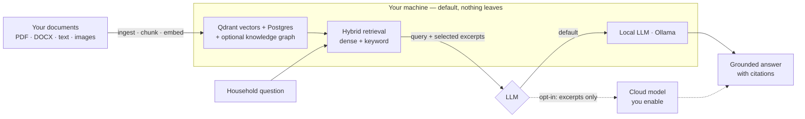

**[Quickstart](#getting-started)** · **[Architecture](#architecture)** · **[Reference manual](docs/LUMOGIS_REFERENCE_MANUAL.md)** · **[Extending Lumogis](docs/extending/extending-the-stack.md)** · **[Community Plugins](COMMUNITY-PLUGINS.md)** · **[Security](SECURITY.md)** · **[Changelog](CHANGELOG.md)**

# lumogis

**A private, self-hosted knowledge base for your whole household.**

Lumogis is a **self-hosted, local-first** knowledge base built for a **household**: multiple people, one shared **Core** on hardware you control. Most self-hosted "second brain" tools are built around one person's notes — Lumogis is built around a **home**, with **per-user personal/shared scopes** as the design centre. Your documents stay yours, but you can **share one with the household in a click** — and everyone can then **search** it and **ask questions grounded in it**, with citations. Everyone reaches it from a browser on your home network via **[Lumogis Web](#lumogis-web)** (same origin behind **[Caddy](docker/caddy/Caddyfile)**); **Core** is the **[FastAPI](orchestrator/main.py)** orchestrator. You run it yourself with Docker Compose under **AGPL-3.0-only**. *(A desktop global-hotkey search overlay — **Lumogis Search** — ships in a later release; the household web experience is the launch surface.)* **[LibreChat](config/librechat.coldstart.yaml)** stays available behind an optional Compose profile (`librechat`) for OpenAI-compatible chat — not the main product surface.

---


**What you're seeing** (two people, one household Core — all local):

1. **Admin** shares a document with the household in one click
2. **Another member** searches and finds that shared document
3. **Anyone** can ask questions grounded in it — with citations from your own files

*Retrieval and inference run on hardware you control — not a SaaS indexer.*

---

## Why Lumogis

You want to ask an LLM questions **grounded in your documents and sessions**, without exporting your corpus to someone else’s cloud.

- **Indexing and retrieval stay on your machine.** Default Compose brings up **Qdrant** for vectors, **Postgres** for metadata (fresh volumes bootstrap from `postgres/init.sql`), and **Ollama** for local embeddings/models—see **`docker-compose.yml`**.

- **When you choose a cloud model**, the provider receives a **composed prompt**: your query plus excerpts Core selected from local retrieval—not your full corpus or embeddings. With **purely local inference**, the **LLM call stays on your host** (your usual outbound traffic, logging, and supply-chain realities still apply).

The source code is **[AGPL-3.0-only](LICENSE)**. There is no Lumogis-operated SaaS substrate in this story—verification is cloning and reading code.

---

## What it does (summary)

**All processing defaults to containers on your machine.** Ingest → chunk → embed → search → sessions → signals → audited actions—all under your Compose project.

| Area | Capability |
|---|---|
| Documents | PDF, DOCX, text, images (OCR when enabled)—see ingestion in [`orchestrator/services/ingest.py`](orchestrator/services/ingest.py) |
| Search | **Hybrid by default**—dense vectors + keyword (sparse) together, so exact-term and fuzzy queries both land; optional BGE reranking—[`orchestrator/services/search.py`](orchestrator/services/search.py), [`ARCHITECTURE.md`](ARCHITECTURE.md) |
| Household sharing | **Share a document with the household in one click**—per-user `personal`/`shared` scopes ([`ADR-015`](docs/decisions/015-personal-shared-system-memory-scopes.md)); your documents stay yours, shared ones are findable by everyone (kids stay scoped) |
| Document-chat | **Ask questions about a document**—grounded answers **with citations**, from your own files |
| Memory | Sessions and summaries embedded locally |
| Signals | RSS, pages, calendars, digest—[`signals/`](orchestrator/signals/) |
| Actions | **[Ask / Do](#security-model-ask-and-do)** with audit logging—[`actions/`](orchestrator/actions/) |
| Models | Local via Ollama; cloud via adapters and `config/models.yaml` |
| Plugins | **[Optional packages](docs/extending/examples/example_plugin/)** under [`orchestrator/plugins/`](orchestrator/plugins/)—loaded at startup |

See the full [capabilities overview](docs/capabilities.md).

---

## Security model: Ask and Do

> **Lumogis proposes. You approve. And over time, the things you always approve just happen.**

Every action lands in **Ask** or **Do**:

| Mode | Behaviour |
|---|---|
| **Ask** | Proposed for approval before anything writes, deletes, or sends externally. |
| **Do** | Executes immediately within a scoped, reversible, low-risk contract. |

Details and examples: **[`docs/LUMOGIS_REFERENCE_MANUAL.md`](docs/LUMOGIS_REFERENCE_MANUAL.md)** (operator narrative) and **[`SECURITY.md`](SECURITY.md)** (reporting and design boundaries).

---

## Architecture

**Five concepts**—every module maps to one: **actions**, **signals**, **services**, **plugins**, and **adapters**. Full layering (routes → services → ports ← adapters; plugins via hooks): **[`ARCHITECTURE.md`](ARCHITECTURE.md)**.


† **Graph capability** is optional. The bundled community stack defaults **`GRAPH_MODE=disabled`**. Falkor-backed in-process projection, HTTP graph capability services, and related Compose overlays ship with the **premium** distribution—not the minimal AGPL export line. Architectural contract: **`ports/graph_store.py`** (Protocol) plus **[`docs/decisions/002-graph-store-falkordb.md`](docs/decisions/002-graph-store-falkordb.md)** and **`docs/extending/extending-the-stack.md`**.

### Data flow

Ingest, indexing, and retrieval run on your machine. Local inference keeps the whole loop on your host; a cloud model is **opt-in** and receives only the query plus Core-selected excerpts — never your corpus or embeddings.


```mermaid
flowchart LR
    Docs["Your documents<br/>PDF · DOCX · text · images"]
    Ask["Household question"]
    Ans["Grounded answer<br/>with citations"]

    subgraph Host["Your machine — default, nothing leaves"]
        Index["Qdrant vectors + Postgres<br/>+ optional knowledge graph"]
        Retrieve["Hybrid retrieval<br/>dense + keyword"]
        Local["Local LLM · Ollama"]
        Index --> Retrieve
    end

    Docs -->|ingest · chunk · embed| Index
    Ask --> Retrieve
    Retrieve -->|query + selected excerpts| LLM{"LLM"}
    LLM -->|default| Local
    LLM -.->|opt-in: excerpts only| Cloud["Cloud model<br/>you enable"]
    Local --> Ans
    Cloud -.-> Ans
```

| Concept | Path | Purpose |
|---|---|---|
| Services | [`orchestrator/services/`](orchestrator/services/) | ingest, search, memory, entities, tools, routines |
| Adapters | [`orchestrator/adapters/`](orchestrator/adapters/) | Concrete backends implementing **ports** (one swap = one adapter + factory branch) |
| Plugins | [`orchestrator/plugins/`](orchestrator/plugins/) | Optional extensions—Core runs without them |
| Signals | [`orchestrator/signals/`](orchestrator/signals/) | Monitors and scoring |
| Actions | [`orchestrator/actions/`](orchestrator/actions/) | Registry, executor, audit |

**Reference:** [`docs/LUMOGIS_REFERENCE_MANUAL.md`](docs/LUMOGIS_REFERENCE_MANUAL.md) · Automated testing overview: [`docs/testing/automated-test-strategy.md`](docs/testing/automated-test-strategy.md).

---

## Lumogis Web

First-party SPA: **[`clients/lumogis-web/`](clients/lumogis-web/)**, served behind Caddy (**[`docker-compose.yml`](docker-compose.yml)** `lumogis-web` + `caddy`). Same-origin preserves strict cookie + CSRF assumptions.

| Where | URL (defaults) |
|---|---|
| **Recommended** | **http://localhost/** — SPA; `/api/*`, `/events`, `/v1/*`, `/mcp/*`, `/health`, and legacy orchestrator HTML routes proxied per **[`docker/caddy/Caddyfile`](docker/caddy/Caddyfile)** |
| **Core directly** | **http://localhost:8000** — Swagger at `/docs` |
| **LibreChat** (`COMPOSE_PROFILES` contains `librechat`) | **http://localhost:3080** — targets **`http://orchestrator:8000/v1`** (**[`config/librechat.coldstart.yaml`](config/librechat.coldstart.yaml)**)

**Operators:** pin **`LUMOGIS_PUBLIC_ORIGIN`** (see **`.env.example`**) when `AUTH_ENABLED=true`; set **`LUMOGIS_TRUSTED_PROXIES`** whenever a trusted reverse proxy terminates TLS (**[`docker-compose.yml`](docker-compose.yml)** passes them through). Playwright/Lighthouse/header checks live in **`clients/lumogis-web/README.md`** and **`Makefile`** targets `web-e2e*`, `web-caddy-headers*`.

---

## Getting started

**Prerequisites:** Docker with Compose v2, Git, and at least 8 GB RAM.

Three commands from clone to a running instance, then open **http://localhost/**:

```bash
git clone https://github.com/lumogis/lumogis.git && cd lumogis
cp .env.example .env
docker compose up -d
```

The full first-run guide — Ollama model pulls, migration checks, smoke test, and common errors — is in **[`docs/deployment/quickstart.md`](docs/deployment/quickstart.md)**.

**Pre-built images (optional):** set **`COMPOSE_FILE=docker-compose.yml:docker-compose.ghcr.yml`** in `.env` and use **`docker compose up -d --pull always`** to run from **`ghcr.io/lumogis/`** without a local build (see the quickstart doc and **`.env.example`** comments).

---

## How do I know it's working?

After a few days of normal use (ingest + chat/search), run the baseline queries and health checks in **[`EVALUATION.md`](EVALUATION.md)** — five search prompts, indexing signals, and copy-paste `curl` / `make doctor` commands for your instance.

---

## Remote access

Lumogis is reachable on your local network by default (**http://localhost/** or your LAN IP). For phones and laptops when someone is away from home, **Tailscale Serve** is the recommended path: it provides HTTPS (required for PWA install and Web Push) with no port forwarding and keeps traffic on your private tailnet rather than the public internet. See **[`docs/deployment/remote-access.md`](docs/deployment/remote-access.md)** for step-by-step setup; **Cloudflare Tunnel** is documented there as an alternative.

---

## Lumogis Search and personas

> **Note:** the desktop **Lumogis Search** overlay ships in a **later release** (v1.1). The launch surface is **[Lumogis Web](#lumogis-web)** in the browser — this section describes the overlay for when it lands.

**Lumogis Search** is the global-hotkey memory-search overlay for your household Core. **Persona A** (Docker Compose on the same machine → `http://localhost`) and **Persona B** (household member → operator URL) ship the **same** client-only installer; see the [persona distribution matrix](docs/LUMOGIS_REFERENCE_MANUAL.md#persona-a--b--c--distribution-matrix) and [Persona A install steps](clients/lumogis-search/README.md#persona-a--docker-track-localhost).

---

## Prerequisites · hardware hints

**Prerequisites:** Git + Docker Desktop (see **`.env.example`** for platform notes). End users do **not** need Python or Make.

**Rough sizing** — RAM/VRAM rises quickly with bigger local models or optional **`RERANKER_BACKEND=bge`**; see **`docs/guides/gpu-setup.md`** and the capacity discussion in **`docs/LUMOGIS_REFERENCE_MANUAL.md`**.

---

## Composition: required vs optional

**Base `docker compose up -d`** (from **`docker-compose.yml`**) pulls up **Orchestrator + Qdrant + Postgres + Ollama + Lumogis Web + Caddy + stack-control** (internal restart helper)—see service list in **`docker-compose.yml`**.

| Add-on | How | Notes |
|---|---|---|
| Knowledge graph overlays (Falkor / in-process plugin / HTTP KG bridge) | Premium Compose bundles + explicit `GRAPH_MODE` | **`GRAPH_MODE` defaults to `disabled`**—set `inprocess` or `service` only with the matching premium modules; see **ADR-002** (`docs/decisions/002-graph-store-falkordb.md`) and **`docs/extending/extending-the-stack.md`** |
| LiteLLM | **`docker-compose.litellm.yml`** | Unified proxy overlay |
| Activepieces | **`docker-compose.activepieces.yml`** | Automation UI |
| GPU | **`docker-compose.gpu.yml`** | NVIDIA Container Toolkit (**[`docs/guides/gpu-setup.md`](docs/guides/gpu-setup.md)**) |
| Speech-to-text sidecar | **`docker-compose.stt.yml`** | Speaches-backed **`POST /api/v1/voice/transcribe`**—see overlay comments and **`docs/guides/troubleshooting.md`** |
| LibreChat | `COMPOSE_PROFILES=librechat` (often default in **`.env.example`** for continuity) | **[`docker-compose.yml`](docker-compose.yml)** profile comments |

Merge overlays with **`COMPOSE_FILE`** in `.env` (patterns in **`.env.example`**).

---

## Configuration pointers

Operational truth lives in **`.env.example`** (committed) and **`orchestrator/config.py`** factories. Typical defaults bind **Postgres**, **Qdrant**, **Ollama**, optional **BGE reranker**, and optional **graph** backends. **Do not assume every configuration snippet reflects code that exists in-tree** — today **`get_vector_store`**, **`get_metadata_store`**, and **`get_embedder`** only instantiate the backends implemented in **`orchestrator/config.py`** (`qdrant` / `postgres` / `ollama` unless you extend the factories).

---

## Extending Lumogis

- **Compose / capability manifests / MCP bridging:** **`docs/extending/extending-the-stack.md`**
- **ADR for ecosystem plumbing:** **`docs/decisions/010-ecosystem-plumbing.md`**
- **Operator verification:** integration tests and stack checks in **[`CONTRIBUTING.md`](CONTRIBUTING.md)** and **[`docs/testing/automated-test-strategy.md`](docs/testing/automated-test-strategy.md)**
- **Optional local STT (Speaches overlay):** **`docker-compose.stt.yml`**, **`docs/guides/gpu-setup.md`**, and **`docs/guides/troubleshooting.md`**

---

## Contributing

First-time contributors: start with **[CONTRIBUTING-BEGINNERS.md](CONTRIBUTING-BEGINNERS.md)** (human steps + copy-paste agent prompt).

See **[CONTRIBUTING.md](CONTRIBUTING.md)** — code boundaries (“services never import concrete adapters”), `make lint` / `make test`, and Docker-based wrappers in **`Makefile`**.

---

## FAQ

**Cloud models mandatory?** No—omit API keys and run locally via **Ollama**.

**Where is data?** Host volumes mapped in Compose (**`docker-compose.yml`**) plus your indexed folder (`FILESYSTEM_ROOT`). **Multiple ingest roots** (admin **`ingest_paths`** with 2+ entries) can auto-generate **`docker-compose.override.yml`** bind mounts and chain **`COMPOSE_FILE`** — see **`.env.example`** comments and **`docs/LUMOGIS_REFERENCE_MANUAL.md`** (restart required after path changes).

**Production-ready?** Solid self-hosted/developer preview—not a turnkey consumer appliance; run it, tighten auth, observe logs.

More depth: **`docs/guides/troubleshooting.md`**, **`docs/LUMOGIS_REFERENCE_MANUAL.md`**.

---

## Community plugins · Security · Licence

- **Community adapters/plugins:** **`COMMUNITY-PLUGINS.md`**
- **Report vulnerabilities:** **`SECURITY.md`** (no public tickets for undisclosed bugs)
- **Backups / portability:** households use **`POST /api/v1/me/export`** and related admin import flows — manifest and refusal semantics in **`docs/guides/per-user-export-format.md`** (**`GET /api/v1/admin/export`** is **`410 Gone`** by design; see **`CHANGELOG.md`** and per-user export ADRs).
- **Publishable tree hygiene** (`scripts/create-upstream-export-tree.sh`, `scripts/check-public-export.sh`): **[`docs/release/public-agpl-release-workflow.md`](docs/release/public-agpl-release-workflow.md)** and **`CONTRIBUTING.md`**.

Lumogis is **`AGPL-3.0-only`** — **`LICENSE`** and SPDX headers (`AGPL-3.0-only`).

---

This project follows the **[Contributor Covenant v2.1](CODE_OF_CONDUCT.md)**.

*Private, local, yours. The AI comes to your data. Not the other way around.*
